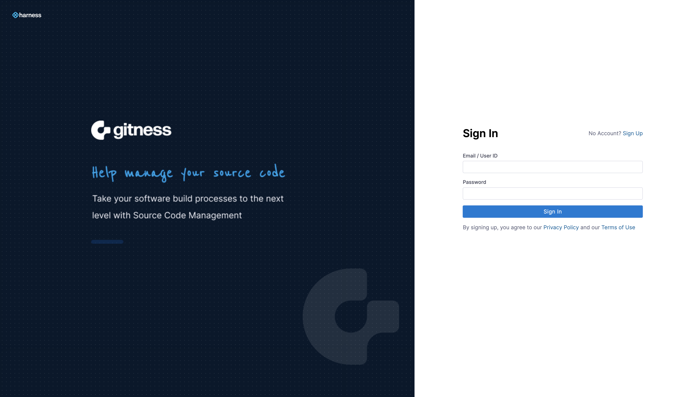
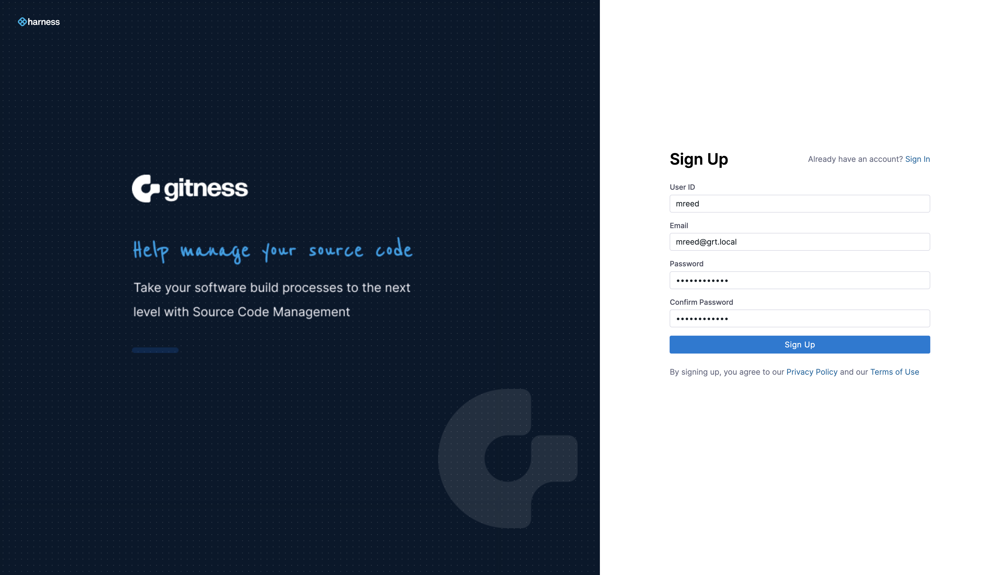
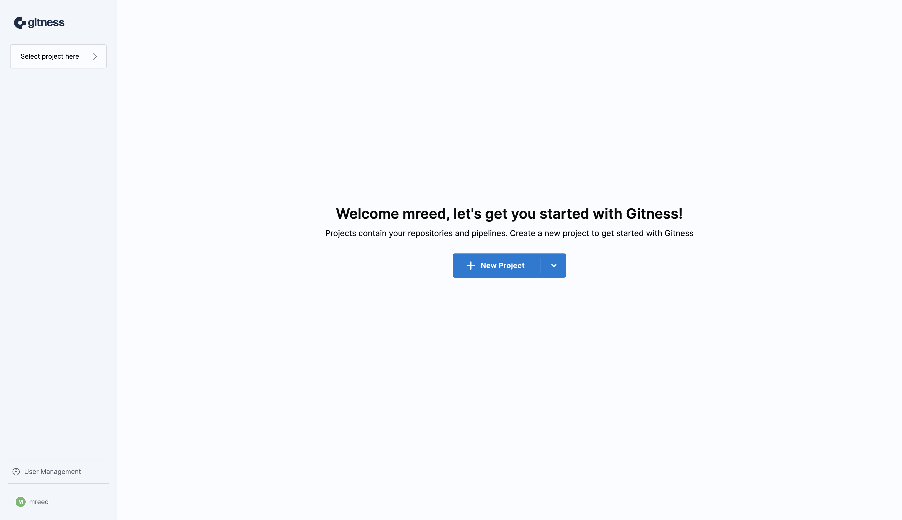
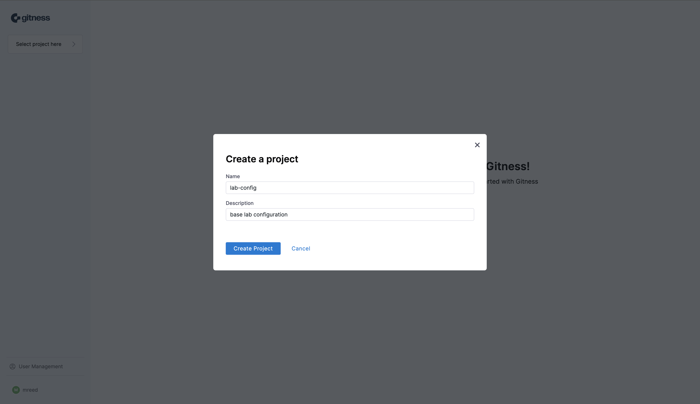
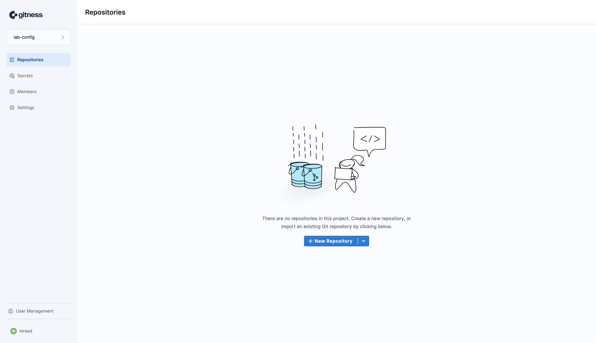
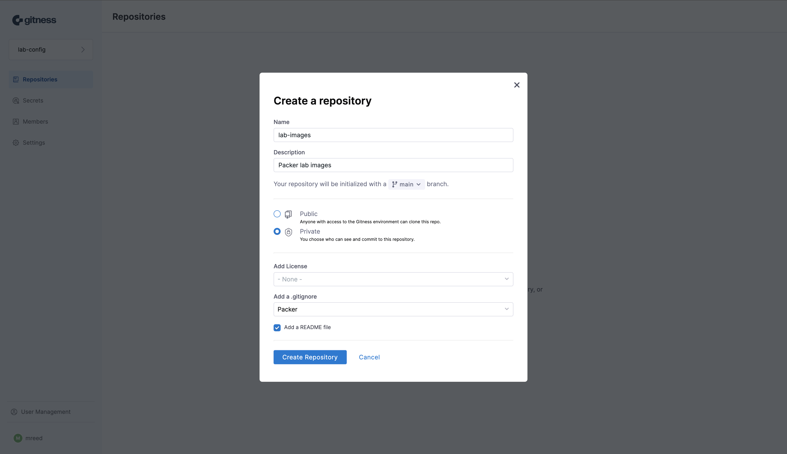
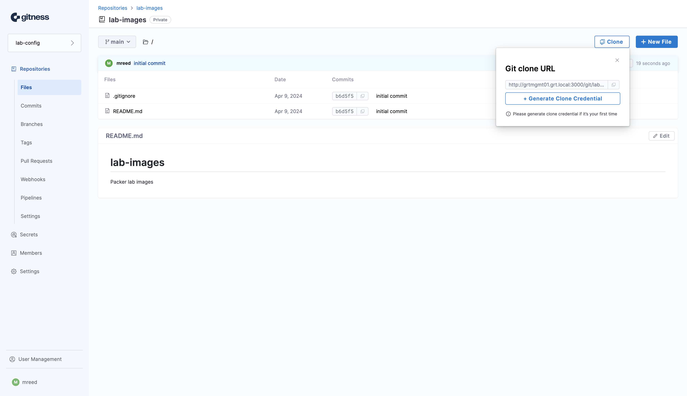
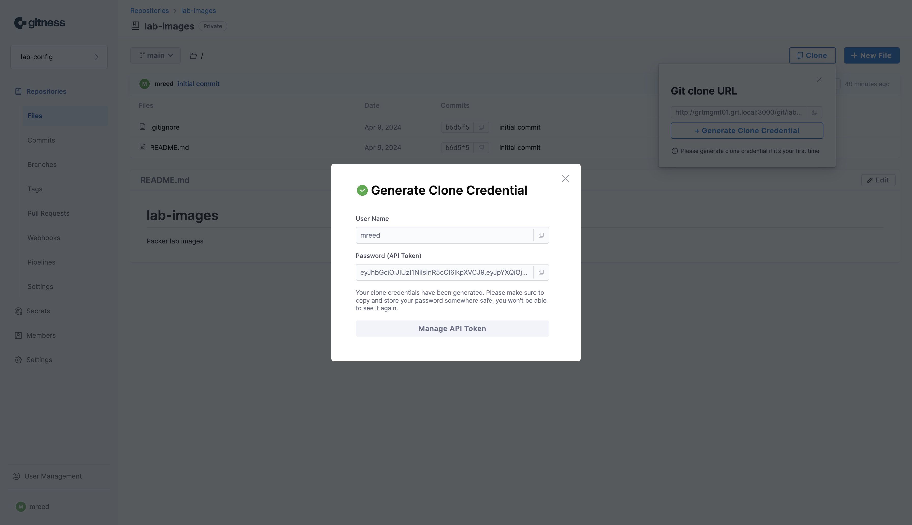

With everything being defined as code nowadays, there's a need for a place to store and version that code. The popular selection would be a version control system (VCS) and more specifically, a git server. There's a myriad of options that include hosted solutions such as Github, Azure DevOps, GitLab.com as well as self-hosted solutions such as Gogs, Gitea, and Gitlab. At this point I've used all of the aformentioned solutions but given that I do most of my tinkering in my homelab, I was looking for a self-hosted solution. A primary requirement was a simple and lightweight solution without all of the bells and whistles as I mainly needed it for just source control. I had heard about Harness introducing a VCS solution ([gitness](https://gitness.com/)) sometime ago but hadn't gotten around to kicking the tires. 

## Installing and Configuring Gitness

Gitness is deployed as a container and supports Docker and Kubernetes deployments. The installation method we're using in this example is Docker for simplicity reasons. One of the things we'll need to do is create a directory on the Docker host to use for data persistence across container restarts.

```bash
mkdir /opt/gitness-data
```

We're using the `docker run` command to start the container. We've specified several environment variables to define the URLs that gitness will use which includes the DNS name of the Docker host along with the port number for some of the entries.

We've mapped the host directory to the `/data` directory in the gitness container where the application's configuration data is stored. The gitness container also needs to interact with the Docker daemon running on the host in order to run Docker containers as part of the solution's pipeline functionality.

```bash
docker run -d \
  -e GITNESS_URL_API=http://grtmgmt01.grt.local:3000/api \
  -e GITNESS_URL_BASE=http://grtmgmt01.grt.local \
  -e GITNESS_URL_GIT=http://grtmgmt01.grt.local:3000/git \
  -e GITNESS_URL_UI=http://grtmgmt01.grt.local:3000 \
  -p 3000:3000 \
  -v /var/run/docker.sock:/var/run/docker.sock \
  -v /opt/gitness-data:/data \
  --name gitness \
  --restart always \
  harness/gitness
```

Once the gitness conatiner has successfully started, we can browse to the hostname or IP address associated with the Docker host running the gitness container at the port specified (3000 by default). Since this is the first time we've accessed gitness, we need to setup a user account. Click on the **Sign Up** link to proceed to the account registration page.



Provide the required information to create a gitness user account. 



Once the sign up process has been completed, we're brought to the initial gitness landing page where we are prompted to create a new project. Click on the **+ New Project** button to launch the create project modal.



Provide a name and description for the project and click the **Create Project** button to create the new project.



We can now launch the create a new repository modal by clicking the **+ New Repository** button.




Provide the repository information such as name, description, and permissions for the git repository. Click the **Create Repository** button once you've completed filling out the form to create a new repository.



With the repository created we can now click on the **Clone** button to copy the URL used to clone the git repository.

We'll need credentials for our user account in order to successfully clone the git repository. Click the **+ Generate Clone Credential** button to generate authentication credentials.



We now need to copy the generated API token. The username and API token are used for authenticating to the git repository.



Now we can clone the git repository using the link provided in the git repository. We'll need to use the username of the account we created and the API token from the previous step. With that we've successfully deployed the gitness VCS solution and we can start pushing and pulling code to our heart's content.