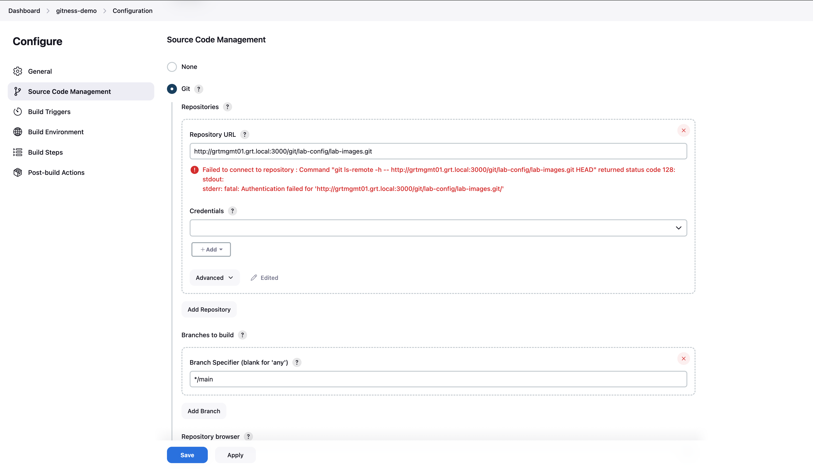

Jenkins is a popular open source CI server and many that are familiar with it often have a bit of a love/hate relationship. That being said, it is an incredibly powerful and flexible tool that is often used when there's a need for a platform for building CI/CD pipelines to deploy code or infrastructure.

In this blog post we'll walk through integrating Jenkins with the Gitness VCS solution.

### Configuring Gitness

The first thing that we need to do is create a service account that will be used to allow our Jenkins server to pull the repositories from the Gitness server. We need to go into the user management section of Gitness and click the **+ New User** button to open the **Create a User** modal.

We need to provide a user ID, email address, and optionally a friendly display name for the Jenkins service account. Click the **Create User** button to create the user account.

We're now presented with a randomly generated password for the service account that we'll need to copy and store for later use. There's also the ability to reset the password later if necessary.

Now that the Jenkins service account has been created we need to designate what projects or repositories that we want to grant it access to. In this case the service account is being granted read access at the project level for the **lab-config** project. Go to the **Members** section of the desired project and click the **+ Add Member** button to launch the add member modal.

Select the Jenkins service account that we previously created and select the Reader role to grant read-only access to the repositories in the project. Click the **Add member to this project** button to grant the service account reader access to the project.

The Jenkins service account has now been added to the project with read-only permissions. 

Now that the service account has been granted read permissions to the desired project, we need to log out and log back in as the service account user.

Once we've successfully logged in, we need to go to the user profile by clicking on the user details in the lower left hand corner.

Click the **+ New Token** button to create a new token for the Jenkins service account.

Provide a name for the service account token as well as the duration of time that the token should be valid. Click **Generate Token** to generate a new user token.

Copy the generated user token for use later when we create the Jenkins credentials for authenticating to gitness.

A simple Jenkins job has been created but we're receiving an authentication error when Jenkins attempts to connect to the repository. We need to add the service account credentials we created in the previous step. Click on the **+Add** button underneath the **Credentials** select list field to add the credentials.

Enter the gitness service account username and password (token) along with an ID to be able to easily reference the desired credential.

With the credentials added, the Jenkins server is now able to successfully connect to the git repository.

With the git repository now accessible, we can trigger the build of the Jenkins job. In this example we're simply running the `ls` command to list the files and directories in the current path to ensure that the git repository downloaded successfully. We can see that there's a README.md file in the current working directory which let's us know that the repository was cloned successfully

### Configuring the Webhook

Normally we want our CI job to automatically run when there are code changes to ensure that the pushed code is tested in a timely manner. Right now when code changes are pushed to our git repository, the CI job will only run when manually triggered. 

We have the option to setup the job to poll on an schedule such as every five minutes or we could have the git server send a trigger to the CI server known as a webhook. The preferred option is to use the webhook, this avoids frequent polling and also reduces the interval between a code change and when the pipeline kicks off. This was the original plan until I ran into a bit of a hiccup. It turns out that Gitness doesn't currently support sending webhooks to private network addresses (RFC 1918). This means that it can't send the webhook message to my Jenkins server and that an alternative option will be needed.

A potential alternative is using gitness' pipeline functionality to actually a pipeline that just triggers a corresponding Jenkins job. This feels somewhat redundant but isn't a completely terrible solution so I may well give a try.

