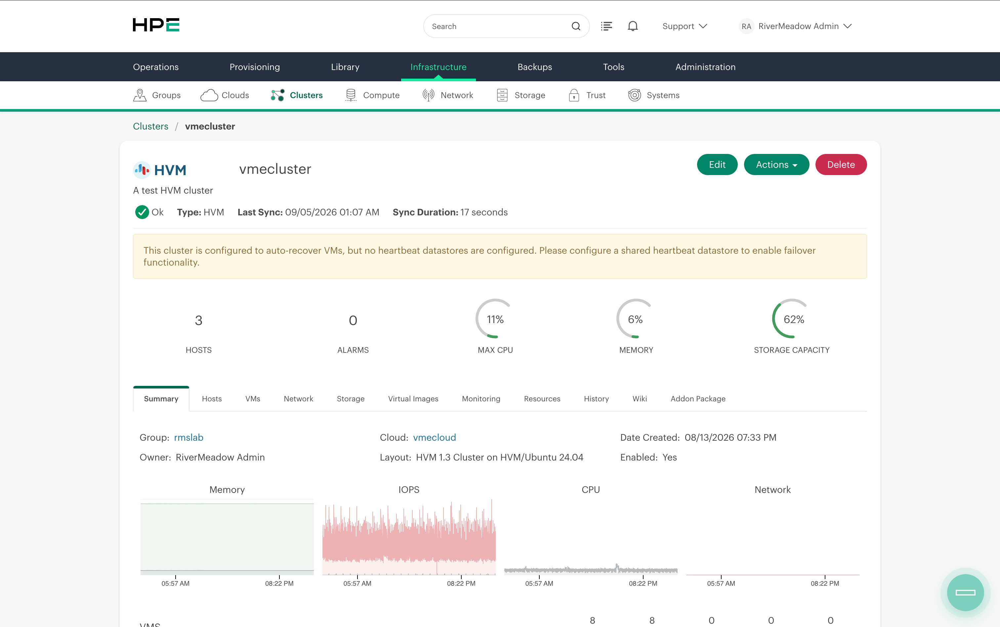

In a previous [blog post](https://www.greenreedtech.com/getting-started-with-hpe-vm-essentials-terraform-provider/) we looked at using HashiCorp Terraform to configure aspects of a HPE Morpheus VM Essentials deployment. In this post we'll take a look at how to use the Terraform provider to deploy an HVM cluster. This can be coupled with Terraform code that provisions the Ubuntu hosts that will become part of the HVM cluster for an end-to-end deployment capability.

## Cluster Creation
In this scenario we're assuming that the Ubuntu hosts that will become part of the cluster have already been provisioned and configured.

**main.tf**

Create a main.tf file and add the following code to define the cluster resource. The `hpe_morpheus_cluster` resource requires several pieces of information to create the HVM cluster such as the group, cloud, layout and more. Many of these require the id of the resource instead of the name. The id of the resource can be found using a terraform data source. The data source is used to translate the user friendly name to the id. This is also extremely helpful when the terraform code is run across different installations or deployments of VM Essentials where the id may not be the same.

The cluster resource includes several different configuration parameters but the following is a fairly minimal configuration that enables deployment of a cluster. Additional details regarding the configuration parameters can be found in the [cluster resource documentation](https://registry.terraform.io/providers/HPE/hpe/latest/docs/resources/morpheus_cluster).

```terraform
data "hpe_morpheus_cloud" "vmecloud" {
  name = "vmecloud"
}

data "hpe_morpheus_group" "vmegroup" {
  name = "vmegroup"
}

data "hpe_morpheus_cluster_layout" "hvmcluster" {
  name = "HVM"
}

resource "hpe_morpheus_cluster" "example_hvm" {
  name        = "vmecluster"
  description = "A test HVM cluster"
  cloud_id    = data.hpe_morpheus_cloud.vmecloud.id
  group_id    = data.hpe_morpheus_group.vmegroup.id
  layout_id   = data.hpe_morpheus_cluster_layout.hvmcluster.id

  config_hvm = {
    create_user       = false
    dynamic_placement = false
    cpu_arch          = "x86_64"
    cpu_model         = "host-model"
    power_policy      = "performance"
  }

  server = {
    service_plan_id          = 2
    ssh_port                 = 22
    ssh_username             = "mreed"
    ssh_password_wo          = "Password123#"
    management_net_interface = "ens1"    

    ssh_hosts = [
        {
          name = "vme01"
          ip   = "192.168.10.20"
        },
        {
          name = "vme02"
          ip   = "192.168.10.21"
        },
        {
          name = "vme03"
          ip   = "192.168.10.22"
        }
      ]
    visibility = "private"
  }
}
```

Now we'll run a `terraform plan` to verify the configuration that Terraform will use to create the cluster.

```bash
terraform plan
```

If the output of the Terraform plan looks good we'll run `terraform apply` to create the HVM cluster.

```bash
terraform apply
```

After a few minutes the cluster should be provisioned and will eventually reach a ready or "ok" state.



The Terraform provider provides a great way to automate the provisioning of an HVM cluster. In my lab environment I couple this with Terraform code that provisions the ubuntu cluster hosts, bootstraps the VME manager, configures VME, and then finally provisions an HVM cluster.