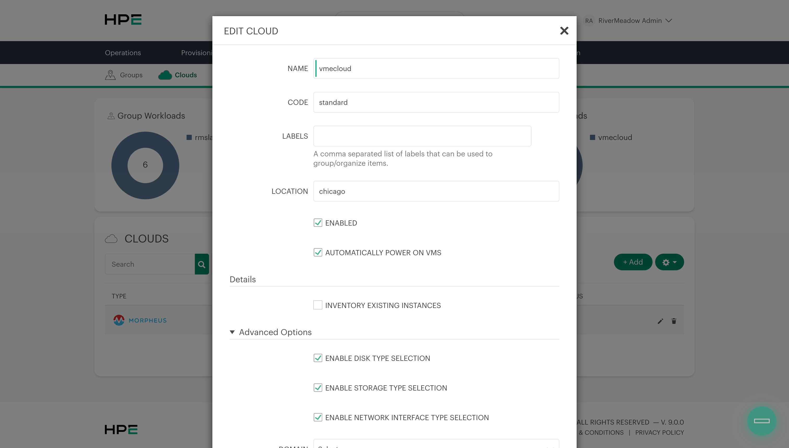

HashiCorp Terraform is a popular infrastructure automation tool used to automate the deployment and configuration of cloud and on-premises infrastructure. In this post we'll take a look at how to use it configre HPE Morpheus VM Essentials.

## Initial Configuration
The first thing we need to do after ensuring that Terraform is installed is to create the provider code that defines the details for interacting with our VM Essentials manager API.

**provider.tf**

Create a provider.tf file and add the following code to specify the version of the provider as well as the VME manager API details. An API token can be used instead of the username and password. Reference the documentation for the Terraform provider for additional details (https://registry.terraform.io/providers/HPE/hpe/latest).

```terraform
terraform {
  required_providers {
    hpe = {
      source  = "HPE/hpe"
      version = ">= 1.6.0"
    }
  }
}

provider "hpe" {
  morpheus {
    url      = "https://192.168.128.243"
    username = "admin"
    password = "SuperSecretPassword123"
    insecure = true
  }
}
```

Run the `terraform init` command to download the VME terraform provider.

```bash
terraform init
```

The next step is to run a `terraform apply` to validate connectivity to the HPE Morheus VM Essentials REST API.

```bash
terraform apply
```

## Resource Creation

The Terraform provider is being used to perform the initial configuration of the HPE Morpheus VM Essentials environment. We'll create a group and a cloud that can later be used for provisioning an HVM cluster to host our virtual machines.

**main.tf**

Create a main.tf file and add the following code to define a group and cloud resource.

```terraform
resource "hpe_morpheus_group" "grtlab" {
  name     = "grtlab"
  code     = "grtlab"
  location = "lab"
}

resource "hpe_morpheus_cloud" "grtcloud" {
  name       = "vmecloud"
  tenant_id  = 1
  group_id   = hpe_morpheus_group.grtlab.id
  enabled    = true
  location   = "chicago"
  visibility = "public"

  agent_install_mode       = "ssh"
  appliance_url            = "https://192.168.128.243"
  auto_recover_power_state = true
  import_existing_vms      = "off"
  costing_mode             = "costing"
  guidance_mode            = "off"
  security_mode            = "off"
  keyboard_layout          = "us"

  config_hvm = {
    certificate_provider          = "internal"
    enable_network_type_selection = true
  }
}
```

Now we'll run a `terraform plan` to verify the resources that Terraform will create.

```bash
terraform plan
```

If the output of the Terraform plan looks good we'll run `terraform apply` to create the group and cloud.

```bash
terraform apply
```

We should now see the newly created resources in the HPE Morpheus VM Essentials UI.



The Terraform provider provides a great way to automate the configuration of an HPE Morpheus VM Essentials environment and would enable the same configuration to be quickly applied across multiple deployments of HPE Morpheus VM Essentials.