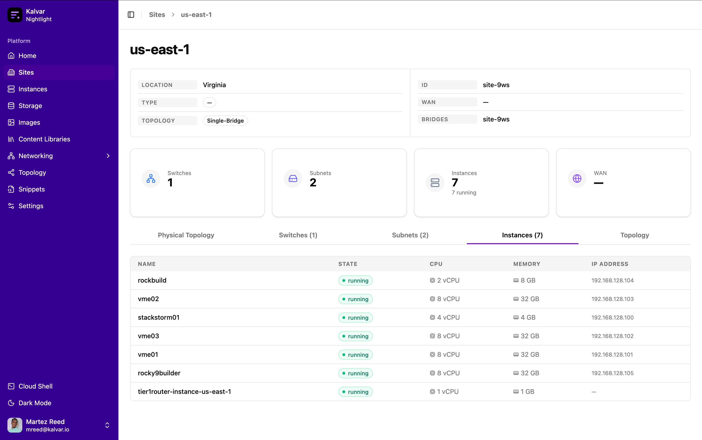
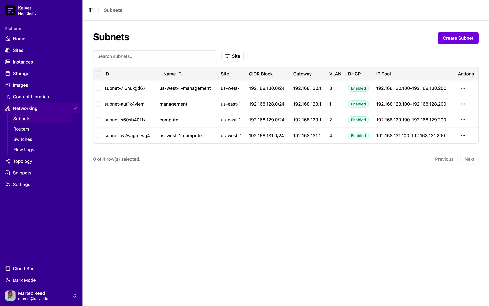
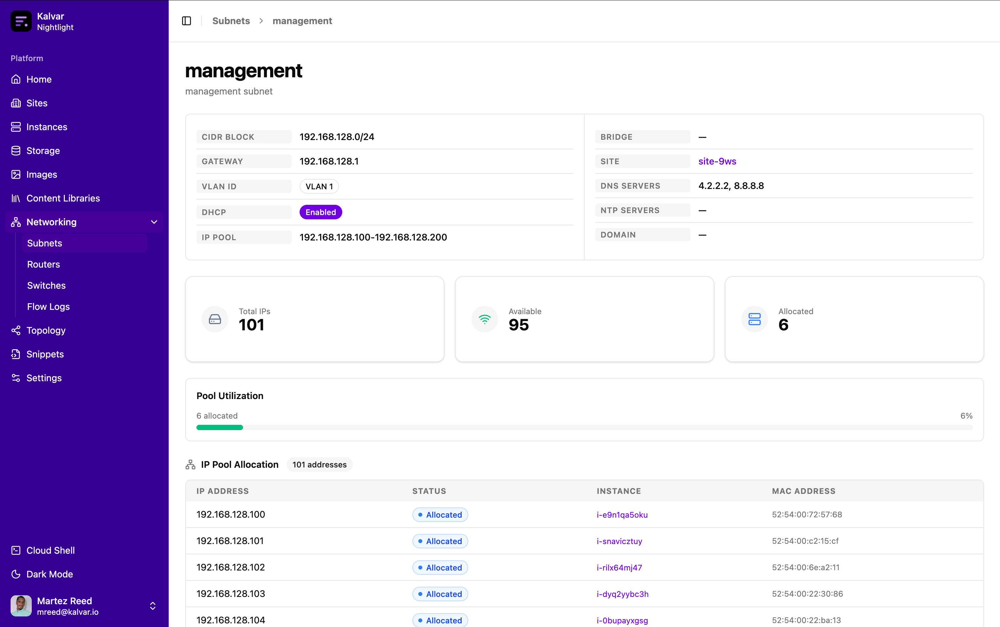
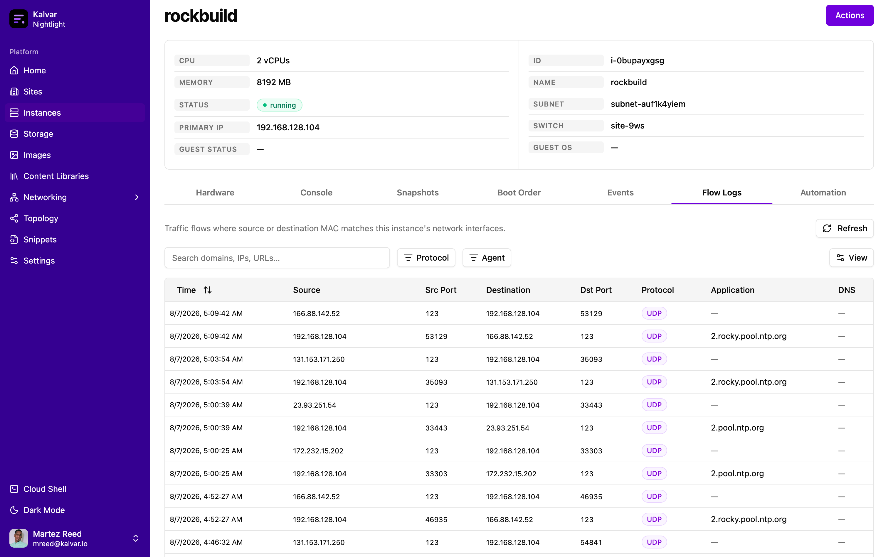
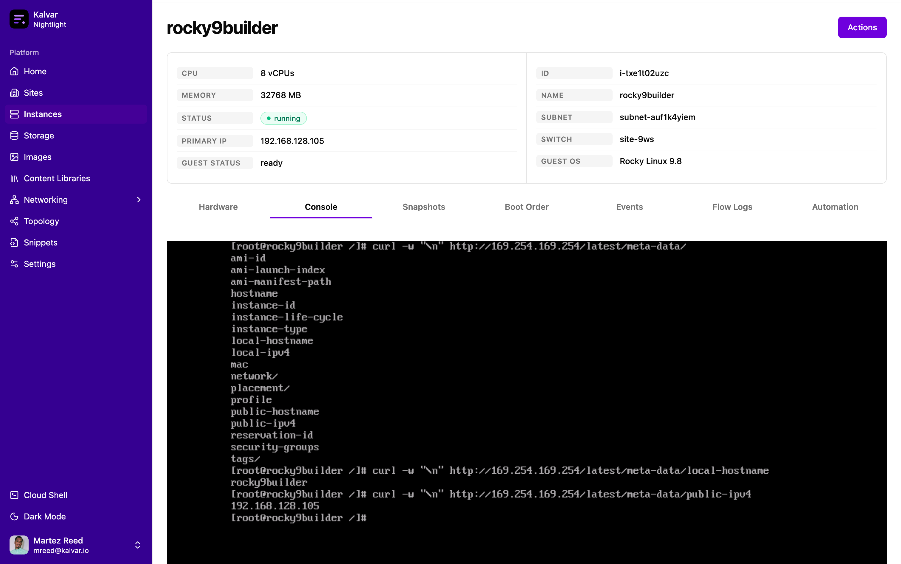

Networking is one of the areas where the difference between a simple home lab and a production enterprise or service provider network really stands out. This makes it difficult to accurately tinker with real life scenarios. This is why a major focus of the homelab hypervisor has been to emulate common networking patterns found in real world environments.

## Sites
The homelab hypervisor supports creating sites which mimic physical locations. The hypervisor includes an edge router that controls traffic in and out of the hypervisor. Each site also includes a router that ultimately connects to the "ISP" edge router via a transit network. Each site also includes one or more Open vSwitch bridges to mimic physical switches.

## Subnets
Subnets mimic layer 3 networks that exist within a given site. Each subnet is assigned a CIDR block and a VLAN. Each instance added to a subnet is assigned to the VLAN or a trunk on the underlying Open vSwitch bridge to mimic a physical switch. Each time a subnet is created a sub interface on the site router is created to support routing traffic for that subnet (VLAN).

## IP Address Management 
The hypervisor includes a native IPAM capability along with a DHCP server to dynamically hand out IP addresses to instances as they're provisioned. The interesting part is that the instance sends out the standard DHCP discover broadcast and the offer is actually provided by a custom OpenFlow SDN controller. The controller programs flow into the Open vSwitch bridge to send DHCP related traffic to the controller itself which handles crafting DHCP packets based on a lookup to the backend. A key function of the native DHCP server is passing the metadata service route to instances during the provisioning process.

## Flow Logs
Visibility of network traffic was a key feature that was added to be able to identify ports and protocols as well as the domains being accessed. The flow logs are captured by mirroring network traffic from the Open vSwitch bridge. The traffic is sent to a process that sends the logs to the backend. This enables flow logs to be viewed globally, per switch, or per virtual machine.

## Metadata Service
One of the particularly interesting networking features of the homelab hypervisor is the support for instance metadata similar to a public cloud. An instance running on the homelab hypervisor can query the metadata service (169.254.169.254) to enable solutions like cloud-init configuration via metadata associated with the instance. This feature utilizes OpenFlow to send packets bound for the metadata service IP address to a service running on the host in a namespace connected to the same Open vSwitch bridge that coordinates with a backend service to fetch the instance metadata.

## Next Steps
The networking capabilities of the homelab hypervisor have been built to support quickly testing advanced networking use cases that would be cost or time prohibitive in many cases. The next steps for the homelab hypervisor is to expand the uses cases by adding support for limiting bandwidth, adding latency, cross-site VPNs, dedicated storage networking and more.